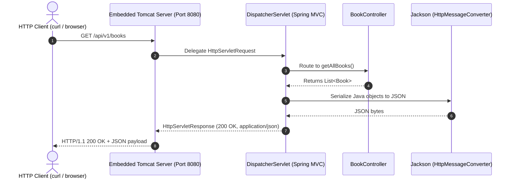

# Tutorial 02 — First endpoint

Create your first Spring Boot endpoint and return JSON.

Files for this stage:

- New: `src/main/java/com/example/bookshop/model/Book.java`
- New: `src/main/java/com/example/bookshop/controller/BookController.java`

---

## 1. Create the model

`Book` is a plain Java class. It has fields and public getters so Jackson can convert it to JSON.

```java
package com.example.bookshop.model;

import java.math.BigDecimal;

/**
 * Plain Java model returned by the first endpoint.
 *
 * | Key            | Why we use it                                      |
 * |----------------|----------------------------------------------------|
 * | BigDecimal     | Stores money without floating-point rounding       |
 * | private fields | Keeps object state accessed through public methods |
 * | public getters | Lets Jackson read values and serialize JSON        |
 */
public class Book {

    private Long id;
    private String title;
    private String author;
    private BigDecimal price;

    public Book(Long id, String title, String author, BigDecimal price) {
        this.id = id;
        this.title = title;
        this.author = author;
        this.price = price;
    }

    public Long getId() {
        return id;
    }

    public String getTitle() {
        return title;
    }

    public String getAuthor() {
        return author;
    }

    public BigDecimal getPrice() {
        return price;
    }
}
```

Important:

- use `BigDecimal` for money
- keep the getters public, otherwise Jackson will not serialize the fields properly

## 2. Create the controller

```java
package com.example.bookshop.controller;

import java.math.BigDecimal;
import java.util.List;

import org.springframework.web.bind.annotation.GetMapping;
import org.springframework.web.bind.annotation.RequestMapping;
import org.springframework.web.bind.annotation.RestController;

import com.example.bookshop.model.Book;

/**
 * First REST endpoint for listing books.
 *
 * | Method | Endpoint       | Status | Description          |
 * |--------|----------------|--------|----------------------|
 * | GET    | /api/v1/books  | 200    | Return sample books  |
 *
 * | Key             | Explanation                                      |
 * |-----------------|--------------------------------------------------|
 * | @RestController | Handles HTTP requests and serializes return data |
 * | @RequestMapping | Sets the shared URL prefix                       |
 * | @GetMapping     | Maps GET requests to the method                  |
 */
@RestController
@RequestMapping("/api/v1/books")
public class BookController {

    @GetMapping
    public List<Book> getAllBooks() {
        return List.of(
                new Book(1L, "Effective Java", "Joshua Bloch", new BigDecimal("54.99")),
                new Book(2L, "Clean Code", "Robert C. Martin", new BigDecimal("42.50"))
        );
    }
}
```

What each annotation means:

- `@RestController` → this class handles HTTP and returns JSON
- `@RequestMapping("/api/v1/books")` → base URL for this controller
- `@GetMapping` → this method handles GET requests

## 3. Run the app

```bash
./mvnw spring-boot:run
```

Then call:

```bash
curl http://localhost:8080/api/v1/books
```

You should get:

```json
[
  {
    "id": 1,
    "title": "Effective Java",
    "author": "Joshua Bloch",
    "price": 54.99
  },
  {
    "id": 2,
    "title": "Clean Code",
    "author": "Robert C. Martin",
    "price": 42.5
  }
]
```

## 4. Why it works

Spring uses Jackson to convert Java objects to JSON.
It looks at the public getters and turns them into fields in the JSON response.

Example:

- `getTitle()` → `"title"`
- `getPrice()` → `"price"`

### Request Lifecycle under the Hood

When a client sends an HTTP request, Spring Boot processes it through the following pipeline:



1. **Embedded Tomcat** receives raw network bytes on port 8080, parses the HTTP protocol, and passes the request to the servlet container.
2. **`DispatcherServlet`** is Spring MVC's central front controller. It inspects all registered `@RequestMapping` paths and routes the URL `/api/v1/books` to `BookController#getAllBooks()`.
3. **`BookController`** executes your Java method and returns a standard `List<Book>`.
4. **`MappingJackson2HttpMessageConverter`** intercepts the return value because the class is annotated with `@RestController` (which includes `@ResponseBody`). It discovers getters using reflection (`getId`, `getTitle`, `getAuthor`, `getPrice`) and produces UTF-8 encoded JSON text.
5. **Tomcat sends the HTTP response**: status `200 OK`, `Content-Type: application/json`, and the serialized body.

You can verify the exact headers using `curl -i`:

```bash
curl -i http://localhost:8080/api/v1/books
```

Output:
```http
HTTP/1.1 200 OK
Content-Type: application/json
Transfer-Encoding: chunked
Date: Thu, 08 Oct 2026 12:00:00 GMT

[{"id":1,"title":"Effective Java","author":"Joshua Bloch","price":54.99},{"id":2,"Clean Code","author":"Robert C. Martin","price":42.5}]
```

## 5. Common mistakes

- wrong URL: `/books` instead of `/api/v1/books`
- missing public getter: Jackson cannot discover private fields without public getters or explicit annotations
- using `double` or `float` instead of `BigDecimal` for price (floating point rounding causes rounding bugs like `42.50000000000001`)
- forgetting `@RestController`: using plain `@Controller` without `@ResponseBody` tells Spring to look for an HTML template file instead of returning JSON

## 6. Goal for this tutorial

By the end of this tutorial, you should understand:

- how a controller maps a URL
- how a Java object becomes JSON
- how `@RestController`, `@RequestMapping`, and `@GetMapping` work together
- how Spring Boot's internal `DispatcherServlet` delegates to your code

Next: [**Tutorial 03 — Layers and dependency injection.**](tutorial-03%20%28Layers%20and%20dependency%20injection%29.md)

