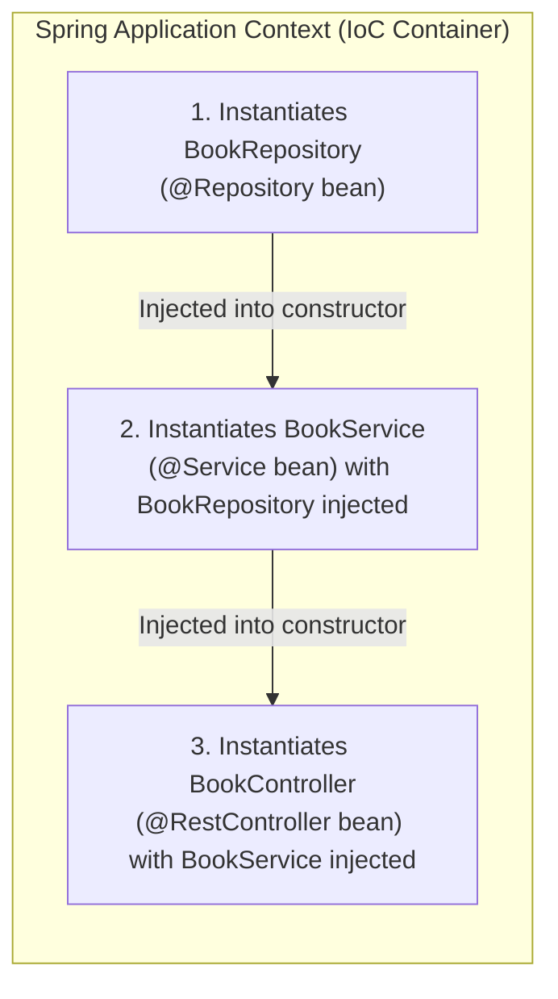

# Tutorial 03 — Layers and dependency injection

Move the book list out of the controller and into proper layers.

Files for this stage:

- New: `src/main/java/com/example/bookshop/repository/BookRepository.java`
- New: `src/main/java/com/example/bookshop/service/BookService.java`
- Updated: `src/main/java/com/example/bookshop/controller/BookController.java`

---

## 1. Separate the responsibilities

The controller should only handle HTTP.
The service should handle business logic.
The repository should handle data access.

Flow:


```text
controller -> service -> repository
```

This keeps the app easier to expand later.

## 2. Simple repository example

At this stage, the repository acts as the boundary for data access.

If you declare a repository interface:

```java
package com.example.bookshop.repository;

import java.util.List;

import com.example.bookshop.model.Book;

/**
 * Repository boundary for book data at this tutorial stage.
 *
 * | Key           | Why we use it                                      |
 * |---------------|----------------------------------------------------|
 * | interface     | Declares data operations without handling HTTP     |
 * | getAllBooks() | Gives the service a method to request all books     |
 */
public interface BookRepository {
    List<Book> getAllBooks();
}
```

> [!IMPORTANT]
> **Spring requires a concrete Bean to instantiate.**
> An interface alone cannot be instantiated by Spring without an implementing class. To make the application run right now before we introduce database persistence in Tutorial 05, provide an `@Repository` class that holds the sample data:

```java
package com.example.bookshop.repository;

import java.math.BigDecimal;
import java.util.List;

import org.springframework.stereotype.Repository;

import com.example.bookshop.model.Book;

/**
 * Concrete repository bean providing sample books for dependency injection.
 *
 * | Key           | Why we use it                                      |
 * |---------------|----------------------------------------------------|
 * | @Repository   | Registers this class as a Spring Bean in context   |
 * | getAllBooks() | Returns sample books without needing a database    |
 */
@Repository
public class BookRepository {

    public List<Book> getAllBooks() {
        return List.of(
                new Book(1L, "Effective Java", "Joshua Bloch", new BigDecimal("54.99")),
                new Book(2L, "Clean Code", "Robert C. Martin", new BigDecimal("42.50"))
        );
    }
}
```

Later, in Tutorial 05, this becomes a full Spring Data JPA repository interface (`public interface BookRepository extends JpaRepository<Book, Long>`), where Spring automatically creates the implementation bean proxy at startup.


## 3. Service with constructor injection

```java
package com.example.bookshop.service;

import java.util.List;

import org.springframework.stereotype.Service;

import com.example.bookshop.model.Book;
import com.example.bookshop.repository.BookRepository;

/**
 * Service layer that delegates book reads to the repository.
 *
 * | Key                    | Why we use it                                   |
 * |------------------------|-------------------------------------------------|
 * | @Service               | Registers this class as application logic       |
 * | final repository field | Makes the dependency required and immutable     |
 * | constructor injection  | Lets Spring provide the repository              |
 */
@Service
public class BookService {

    private final BookRepository bookRepository;

    public BookService(BookRepository bookRepository) {
        this.bookRepository = bookRepository;
    }

    public List<Book> getAllBooks() {
        return bookRepository.getAllBooks();
    }
}
```

This is the key idea:

- the service declares what it needs
- Spring injects it automatically

## 4. Controller delegates to the service

```java
package com.example.bookshop.controller;

import java.util.List;

import org.springframework.web.bind.annotation.GetMapping;
import org.springframework.web.bind.annotation.RequestMapping;
import org.springframework.web.bind.annotation.RestController;

import com.example.bookshop.model.Book;
import com.example.bookshop.service.BookService;

/**
 * Book HTTP endpoints. The controller delegates data work to BookService.
 *
 * | Method | Endpoint       | Status | Description          |
 * |--------|----------------|--------|----------------------|
 * | GET    | /api/v1/books  | 200    | List all books       |
 *
 * | Key             | Explanation                                      |
 * |-----------------|--------------------------------------------------|
 * | @RestController | Handles HTTP requests and serializes return data |
 * | @RequestMapping | Sets the shared URL prefix                       |
 * | @GetMapping     | Maps GET requests to the method                  |
 */
@RestController
@RequestMapping("/api/v1/books")
public class BookController {

    private final BookService bookService;

    public BookController(BookService bookService) {
        this.bookService = bookService;
    }

    @GetMapping
    public List<Book> getAllBooks() {
        return bookService.getAllBooks();
    }
}
```

Now the controller is thin and focused on HTTP only.

## 5. Why constructor injection is preferred

This pattern is used throughout modern Spring development:

```java
private final BookRepository bookRepository;

public BookService(BookRepository bookRepository) {
    this.bookRepository = bookRepository;
}
```



Benefits:

- **Immutable dependencies**: `final` fields prevent reassigning dependencies after construction.
- **Fail-fast instantiation**: If a required bean is missing, Spring fails at startup rather than throwing a `NullPointerException` later at runtime.
- **Trivial unit testing**: You can instantiate `new BookService(mockRepository)` in a test without needing reflection or starting a full Spring test runner.
- **No manual wiring**: No `new` calls in production code; Spring resolves and wires the dependency graph automatically.

> [!NOTE]
> In Spring Boot 4 / Spring Framework 6+, if a class has a single constructor, you do **not** need the `@Autowired` annotation on that constructor. Spring automatically treats it as the injection target.

## 6. Run it

```bash
./mvnw spring-boot:run
```

Then call:

```bash
curl http://localhost:8080/api/v1/books
```

The response should still be the same as in tutorial 02:

```json
[
  {
    "id": 1,
    "title": "Effective Java",
    "author": "Joshua Bloch",
    "price": 54.99
  },
  {
    "id": 2,
    "title": "Clean Code",
    "author": "Robert C. Martin",
    "price": 42.5
  }
]
```

## 7. Common errors and how to fix them

**Error 1 — Missing bean definition:**

```text
Parameter 0 of constructor in com.example.bookshop.service.BookService required a bean of type 'com.example.bookshop.repository.BookRepository' that could not be found.
```

Fix:
- Ensure `BookRepository` is annotated with `@Repository` (or implements an interface with an `@Repository` implementation).
- Verify the class is inside `com.example.bookshop` (or a subpackage) so Spring's `@SpringBootApplication` component scan discovers it.

**Error 2 — Circular dependency:**

If Service A injects Service B and Service B injects Service A, Spring fails startup with a circular reference error. Separate the responsibilities into distinct layers or a shared helper service.

## 8. Goal for this tutorial

By the end of this tutorial, you should understand:

- why controller/service/repository are separated
- what dependency injection and Inversion of Control (IoC) mean
- why constructor injection is the industry standard
- how Spring wires beans together in the application context

Next: [**Tutorial 04 — Configuration**](tutorial-04%20%28Configuration%29.md)

