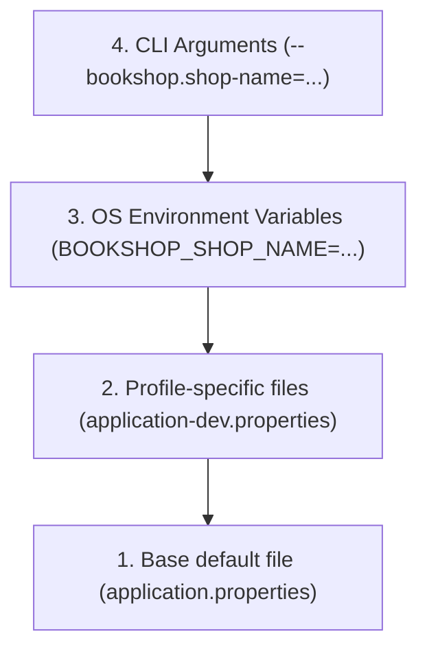

# Tutorial 04 — Configuration

Move the shop name and currency out of Java code and into Spring configuration.

Why configuration matters: application settings change between environments and teams, but the Java code should not need to be edited each time. We keep environment-specific values outside the code so the same app can run in development, test, and production with different URLs, credentials, feature flags, and limits.

Common use cases for configuration:

- different database URLs and credentials per environment
- secret keys, JWT settings, and admin defaults
- feature toggles for turning parts of the app on or off
- server ports, timeouts, and cache settings
- external service endpoints such as payment or email providers

Files used in this tutorial:

- Updated: `src/main/resources/application.properties`
- New: `src/main/resources/application-dev.properties`
- New: `src/main/resources/application-prod.properties`
- New: `src/main/java/com/example/bookshop/config/BookshopProperties.java`
- New: `src/main/java/com/example/bookshop/controller/ShopController.java`
- Updated: `src/main/java/com/example/bookshop/BookshopApplication.java`

---

## 1. Add the default values

Add these settings to `application.properties`:

```properties
bookshop.shop-name=Bookshop
bookshop.currency=USD
```

The `bookshop` prefix groups the settings that belong to this application.

## 2. Add profile-specific overrides

In `application-dev.properties`, override the shop name for development:

```properties
bookshop.shop-name=Bookshop (dev)
```

In `application-prod.properties`, allow the deployed environment to provide the name:

```properties
bookshop.shop-name=${BOOKSHOP_SHOP_NAME:Bookshop}
```

Activate a profile when starting the app:

```bash
SPRING_PROFILES_ACTIVE=dev ./mvnw spring-boot:run
```

Spring loads the base properties first, then applies the active profile's overrides. Environment variables can also override properties, for example `BOOKSHOP_CURRENCY=EUR`.

## 3. Bind the settings to a Java class

Create `BookshopProperties.java`:

```java
package com.example.bookshop.config;

import org.springframework.boot.context.properties.ConfigurationProperties;

/**
 * Typed Java representation of the bookshop settings.
 *
 * | Key / Annotation         | Why we use it                                    |
 * |--------------------------|--------------------------------------------------|
 * | @ConfigurationProperties | Binds bookshop.* values to these fields          |
 * | shopName / currency       | Hold configured values used by the application  |
 * | getters and setters       | Allow Spring's property binder to read and write |
 */
@ConfigurationProperties(prefix = "bookshop")
public class BookshopProperties {

    private String shopName;
    private String currency;

    public String getShopName() {
        return shopName;
    }

    public void setShopName(String shopName) {
        this.shopName = shopName;
    }

    public String getCurrency() {
        return currency;
    }

    public void setCurrency(String currency) {
        this.currency = currency;
    }
}
```

Spring maps `bookshop.shop-name` to `shopName` and `bookshop.currency` to `currency`.

Why a config package: the application settings belong in one place, not scattered across controllers, services, and startup classes. A dedicated config package keeps the settings organized, easy to read, and easy to reuse in multiple parts of the app.

## 4. Register the configuration class

In `BookshopApplication.java`, add the import and annotation to the existing app class:

```java
import org.springframework.boot.context.properties.ConfigurationPropertiesScan;

/**
 * Existing application entry point with settings scanning enabled.
 *
 * | Key                           | Why we use it                                  |
 * |-------------------------------|------------------------------------------------|
 * | @SpringBootApplication        | Enables bootstrapping and component scanning  |
 * | @ConfigurationPropertiesScan | Registers typed settings classes as beans      |
 */
@SpringBootApplication
@ConfigurationPropertiesScan
public class BookshopApplication {
    // Keep the existing main method.
}
```

This makes `BookshopProperties` available for injection.

## 5. Read the settings in a controller

Create `ShopController.java`:

```java
package com.example.bookshop.controller;

import java.util.Map;

import org.springframework.web.bind.annotation.GetMapping;
import org.springframework.web.bind.annotation.RequestMapping;
import org.springframework.web.bind.annotation.RestController;

import com.example.bookshop.config.BookshopProperties;

/**
 * REST endpoint for returning the configured shop details.
 *
 * | Method | Endpoint      | Status | Description                |
 * |--------|---------------|--------|----------------------------|
 * | GET    | /api/v1/shop  | 200    | Return shop name/currency  |
 *
 * | Key                    | Explanation                           |
 * |------------------------|---------------------------------------|
 * | Constructor injection  | Provides the typed configuration      |
 */
@RestController
@RequestMapping("/api/v1/shop")
public class ShopController {

    private final BookshopProperties properties;

    public ShopController(BookshopProperties properties) {
        this.properties = properties;
    }

    @GetMapping
    public Map<String, String> getShopInfo() {
        return Map.of(
                "name", properties.getShopName(),
                "currency", properties.getCurrency()
        );
    }
}
```

Run the app and request `GET /api/v1/shop` to see the configured values:

```bash
./mvnw spring-boot:run
```

In another terminal:

```bash
curl http://localhost:8080/api/v1/shop
```

Expected JSON response:

```json
{
  "name": "Bookshop",
  "currency": "USD"
}
```

Now restart with the `dev` profile:

```bash
SPRING_PROFILES_ACTIVE=dev ./mvnw spring-boot:run
```

And test again:

```bash
curl http://localhost:8080/api/v1/shop
```

Expected JSON response (reflecting `application-dev.properties`):

```json
{
  "name": "Bookshop (dev)",
  "currency": "USD"
}
```

## 6. How Spring resolves configuration (Precedence)

Spring evaluates properties in a well-defined order of precedence, where later sources override earlier ones:



| Priority | Source | Example Syntax |
|---|---|---|
| Highest | Command-line arguments | `--bookshop.currency=CAD` |
| High | OS environment variables | `BOOKSHOP_CURRENCY=EUR` |
| Medium | Active profile property files | `application-dev.properties` |
| Baseline | Default property files | `application.properties` |

> [!NOTE]
> In Tutorial 10, we will also add nested configuration for catalog pagination (`bookshop.catalog.default-page-size=10` and `bookshop.catalog.max-page-size=100`) by adding a nested static class `Catalog` inside `BookshopProperties`. Spring Boot seamlessly binds nested properties to nested Java objects.

## 7. Common mistakes

- Naming a profile file `application_dev.properties` instead of `application-dev.properties` (must use a hyphen).
- Forgetting `@ConfigurationPropertiesScan` on the `@SpringBootApplication` class.
- Misspelling a property key or setter name (Spring maps kebab-case `shop-name` to camelCase `setShopName(...)` via relaxed binding).
- Forgetting getters and setters: without public getters and setters, Spring cannot bind or read the property values.

## 8. Goal for this tutorial

By the end of this tutorial, you should understand:

- why application configurations are externalized from Java source code
- how Spring profiles (`dev`, `prod`) override base settings
- how `@ConfigurationProperties` provides type-safe access to application settings
- how `@ConfigurationPropertiesScan` discovers typed configuration classes

Next: [**Tutorial 05 — Database and JPA**](tutorial-05%20%28Database%20and%20JPA%29.md)

