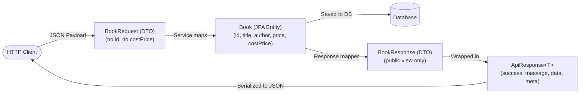

# Tutorial 07 — DTOs and the response envelope

Keep database entities separate from the JSON sent to and received from clients.

Files for this stage:

- New: `src/main/java/com/example/bookshop/dto/ApiResponse.java`
- New: `src/main/java/com/example/bookshop/dto/BookRequest.java`
- New: `src/main/java/com/example/bookshop/dto/BookResponse.java`
- Updated: `src/main/java/com/example/bookshop/model/Book.java`
- Updated: `src/main/java/com/example/bookshop/service/BookService.java`
- Updated: `src/main/java/com/example/bookshop/controller/BookController.java`

At this stage, `Book.author` is still a string, as in tutorial 6. Tutorial 10 changes it into an author relationship. Validation annotations are added in tutorial 8.

---

## 1. Add an internal field to `Book`

Add `costPrice` to the `Book` entity. The shop needs this value internally, but it should not be part of the public API.

```java
@Column(precision = 10, scale = 2)
private BigDecimal costPrice;

public BigDecimal getCostPrice() {
    return costPrice;
}

public void setCostPrice(BigDecimal costPrice) {
    this.costPrice = costPrice;
}
```

Keep the existing fields, imports, constructors, and methods. If your database table is managed by Flyway, add the matching column through a new migration rather than changing an already-applied migration.

## 2. Create the response envelope

Create `ApiResponse.java`. The `data` field can hold one result or a list; `meta` can hold optional extra information such as pagination later.

```java
package com.example.bookshop.dto;

import com.fasterxml.jackson.annotation.JsonInclude;

/**
 * Shared successful-response structure for API endpoints.
 *
 * | Key             | Why we use it                                      |
 * |-----------------|----------------------------------------------------|
 * | @JsonInclude    | Omits optional fields whose value is null          |
 * | T data          | Holds one response DTO or a list of DTOs            |
 * | meta            | Holds optional paging or other response metadata    |
 * | ok(...)         | Creates the common successful-response form         |
 */
/*
 * @JsonInclude(JsonInclude.Include.NON_NULL) tells Jackson, the JSON library
 * Spring uses, to skip fields whose value is null. For example, if meta is
 * null, the response omits it instead of returning "meta": null.
 */
@JsonInclude(JsonInclude.Include.NON_NULL)
/*
 * This record defines the common response fields. The generic type T lets
 * data hold different kinds of results, such as one book or a list of books.
 */
public record ApiResponse<T>(boolean success, String message, T data, Object meta) {

    /*
     * These two methods use method overloading: Java has no optional
     * parameters, so this version is for responses that do not need meta.
     * It sets meta to null, so callers do not have to pass null themselves.
     */
    public static <T> ApiResponse<T> ok(String message, T data) {
        return new ApiResponse<>(true, message, data, null);
    }

    // Use this version when the response includes extra information, such as pagination.
    public static <T> ApiResponse<T> ok(String message, T data, Object meta) {
        return new ApiResponse<>(true, message, data, meta);
    }
}
```

For example, the response becomes:

```json
{
  "success": true,
  "message": "Book fetched",
  "data": {
    "id": 1,
    "title": "Effective Java",
    "author": "Joshua Bloch",
    "price": 54.99
  }
}
```

## 3. Create the request and response DTOs

Create `BookRequest.java`. The client sends only fields it is allowed to set: no database id and no internal `costPrice`.

```java
package com.example.bookshop.dto;

import java.math.BigDecimal;

/**
 * Allow-listed fields clients may provide when writing a book.
 *
 * | Key          | Why we use it                                     |
 * |--------------|---------------------------------------------------|
 * | title/author | Client-editable book details                      |
 * | price        | Client-provided selling price                     |
 * | no id        | Database assigns the primary key                  |
 * | no costPrice | Keeps internal shop cost out of requests          |
 */
public record BookRequest(String title, String author, BigDecimal price) {
}
```

Because `BookRequest` is a Java `record`, Java creates the accessors `title()`, `author()`, and `price()` from those component names. The service code below uses these record accessors. If you made `BookRequest` a regular class instead, use its getter methods, such as `request.getTitle()` and `request.getPrice()`, or change it to the record shown here.

Create `BookResponse.java`. Its `from` method chooses exactly which entity fields are returned:

```java
package com.example.bookshop.dto;

import java.math.BigDecimal;

import com.example.bookshop.model.Book;

/**
 * Allow-listed public representation of a book.
 *
 * | Key        | Why we use it                                      |
 * |------------|----------------------------------------------------|
 * | record     | Defines an immutable response data carrier         |
 * | from(...) | Maps only selected entity fields into the response  |
 * | no costPrice | Prevents leaking internal cost to API clients    |
 */
public record BookResponse(Long id, String title, String author, BigDecimal price) {

    public static BookResponse from(Book book) {
        return new BookResponse(
                book.getId(),
                book.getTitle(),
                book.getAuthor(),
                book.getPrice());
    }
}
```

## 4. Map requests in the service

Update the create and update methods in `BookService`. Convert the incoming request into entity fields, then save the entity through the repository:

```java
public Book createBook(BookRequest request) {
    /*
     * | Key / Call             | Why we use it                             |
     * |------------------------|-------------------------------------------|
     * | BookRequest            | Receives only client-allowed fields       |
     * | new Book(...)          | Maps the request DTO into a database entity|
     * | bookRepository.save()  | Persists the new entity                    |
     */
    Book book = new Book(request.title(), request.author(), request.price());
    return bookRepository.save(book);
}

public Book updateBook(Long id, BookRequest changes) {
    Book book = getBookById(id);
    book.setTitle(changes.title());
    book.setAuthor(changes.author());
    book.setPrice(changes.price());
    return bookRepository.save(book);
}
```

Keep the existing `getAllBooks`, `getBookById`, and `deleteBook` service methods from tutorial 6.

## 5. Return DTOs from every controller route

Replace the tutorial 6 controller with this version. Each route converts entities to `BookResponse`; the create route keeps its `201 Created` status and `Location` header.

```java
package com.example.bookshop.controller;

import java.net.URI;
import java.util.List;

import org.springframework.http.ResponseEntity;
import org.springframework.web.bind.annotation.DeleteMapping;
import org.springframework.web.bind.annotation.GetMapping;
import org.springframework.web.bind.annotation.PathVariable;
import org.springframework.web.bind.annotation.PostMapping;
import org.springframework.web.bind.annotation.PutMapping;
import org.springframework.web.bind.annotation.RequestBody;
import org.springframework.web.bind.annotation.RequestMapping;
import org.springframework.web.bind.annotation.RestController;

import com.example.bookshop.dto.ApiResponse;
import com.example.bookshop.dto.BookRequest;
import com.example.bookshop.dto.BookResponse;
import com.example.bookshop.model.Book;
import com.example.bookshop.service.BookService;

/**
 * Book REST endpoints using request/response DTOs and a response envelope.
 *
 * | Method | Endpoint             | Status | Description                    |
 * |--------|----------------------|--------|--------------------------------|
 * | GET    | /api/v1/books        | 200    | Return enveloped book list     |
 * | GET    | /api/v1/books/{id}   | 200    | Return one enveloped book      |
 * | POST   | /api/v1/books        | 201    | Create; include Location       |
 * | PUT    | /api/v1/books/{id}   | 200    | Update a book                  |
 * | DELETE | /api/v1/books/{id}   | 200    | Delete a book                  |
 *
 * | Key                | Explanation                                      |
 * |--------------------|--------------------------------------------------|
 * | @RequestBody       | Converts JSON into BookRequest                   |
 * | @PathVariable      | Binds {id} from the URL to a method parameter    |
 * | ResponseEntity     | Sets create status and Location header           |
 * | ApiResponse        | Gives responses a consistent JSON body           |
 */
@RestController
@RequestMapping("/api/v1/books")
public class BookController {

    private final BookService bookService;

    public BookController(BookService bookService) {
        this.bookService = bookService;
    }

    @GetMapping
    public ApiResponse<List<BookResponse>> getAllBooks() {
        List<BookResponse> books = bookService.getAllBooks().stream()
                .map(BookResponse::from)
                .toList();

        return ApiResponse.ok("Books fetched", books);
    }

    @GetMapping("/{id}")
    public ApiResponse<BookResponse> getBookById(@PathVariable Long id) {
        BookResponse book = BookResponse.from(bookService.getBookById(id));

        return ApiResponse.ok("Book fetched", book);
    }

    @PostMapping
    public ResponseEntity<ApiResponse<BookResponse>> createBook(@RequestBody BookRequest request) {
        Book saved = bookService.createBook(request);
        URI location = URI.create("/api/v1/books/" + saved.getId());

        return ResponseEntity.created(location)
                .body(ApiResponse.ok("Book created", BookResponse.from(saved)));
    }

    @PutMapping("/{id}")
    public ApiResponse<BookResponse> updateBook(@PathVariable Long id,
            @RequestBody BookRequest request) {
        return ApiResponse.ok("Book updated",
                BookResponse.from(bookService.updateBook(id, request)));
    }

    @DeleteMapping("/{id}")
    public ApiResponse<Void> deleteBook(@PathVariable Long id) {
        bookService.deleteBook(id);

        return ApiResponse.ok("Book deleted", null);
    }
}
```

`@RequestBody` converts JSON into `BookRequest`. The DTO does not have an `id` or `costPrice`, so clients cannot set those fields through these endpoints. Tutorial 8 adds `@Valid` and field constraints; tutorial 9 replaces the temporary not-found exception with the standard error response.

## 6. Why use DTOs?

Returning the entity directly could expose internal fields such as `costPrice`. A response DTO is an allow-list: only the fields declared in `BookResponse` are sent to the client.



### Why Java Records for DTOs?

1. **Immutability by default**: Fields are `final`, preventing unintended mutation across service and controller layers.
2. **Boilerplate reduction**: The compiler generates accessors (`title()`, `author()`, `price()`), `equals()`, `hashCode()`, and `toString()`.
3. **Transparent data carrier**: Clearly signals that the class is intended purely for transferring data across architectural boundaries, not for holding complex mutable business logic.

## 7. Try the enveloped endpoints

Start the app:

```bash
SPRING_PROFILES_ACTIVE=dev ./mvnw spring-boot:run
```

### 1. Fetch all books (GET)

```bash
curl http://localhost:8080/api/v1/books
```

Response:

```json
{
  "success": true,
  "message": "Books fetched",
  "data": [
    {
      "id": 1,
      "title": "Effective Java",
      "author": "Joshua Bloch",
      "price": 54.99
    },
    {
      "id": 2,
      "title": "Clean Code",
      "author": "Robert C. Martin",
      "price": 42.5
    },
    {
      "id": 3,
      "title": "The Pragmatic Programmer",
      "author": "Andrew Hunt",
      "price": 49.95
    }
  ]
}
```

Notice that `costPrice` is completely absent from the JSON payload.

### 2. Create a book (POST)

```bash
curl -i -X POST http://localhost:8080/api/v1/books \
  -H 'Content-Type: application/json' \
  -d '{"title":"Design Patterns","author":"Erich Gamma","price":55.00}'
```

Response:

```http
HTTP/1.1 201 Created
Location: /api/v1/books/4
Content-Type: application/json

{
  "success": true,
  "message": "Book created",
  "data": {
    "id": 4,
    "title": "Design Patterns",
    "author": "Erich Gamma",
    "price": 55.0
  }
}
```

Next: [**Tutorial 08 — Validation**](tutorial-08%20%28Validation%29.md)

