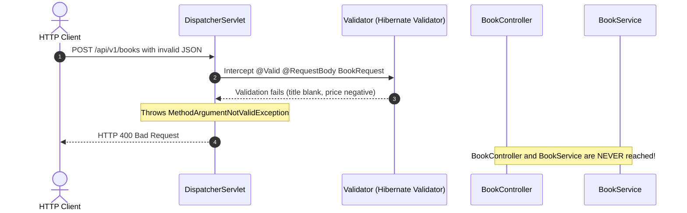

# Tutorial 08 — Validation

Reject bad input before it reaches the service.

Files for this stage:

- Updated: `pom.xml`
- Updated: `src/main/java/com/example/bookshop/dto/BookRequest.java`
- Updated: `src/main/java/com/example/bookshop/controller/BookController.java`

---

## 1. Add the validation dependency

Add this inside the `<dependencies>` section of `pom.xml`:

```xml
<dependency>
        <groupId>org.springframework.boot</groupId>
        <artifactId>spring-boot-starter-validation</artifactId>
</dependency>
```

This provides the validation annotations and runtime support. If your IDE says `NotBlank` or another constraint cannot be resolved, check that this dependency is present and Maven has reloaded the project.

## 2. Add constraints to the request DTO

```java
package com.example.bookshop.dto;

import java.math.BigDecimal;

import jakarta.validation.constraints.Digits;
import jakarta.validation.constraints.NotBlank;
import jakarta.validation.constraints.NotNull;
import jakarta.validation.constraints.Positive;
import jakarta.validation.constraints.Size;

/**
 * Validation rules for BookRequest
 * <p>
 * | Annotation            | Field          | Explanation                                              |
 * |-----------------------|----------------|----------------------------------------------------------|
 * | @NotBlank             | title, author  | Rejects null, empty "", or whitespace-only "   " values  |
 * | @Size(max = 200)      | title          | Limits the title to at most 200 characters               |
 * | @NotNull              | price          | Rejects a missing or null price                          |
 * | @Positive             | price          | Price must be greater than 0 (0 and negatives fail)      |
 * | @Digits(8, 2)         | price          | Up to 8 digits before and 2 after the decimal point      |
 */


public record BookRequest(

        @NotBlank(message = "title is required")
        @Size(max = 200, message = "title must be at most 200 characters")
        String title,

        @NotBlank(message = "author is required")
        String author,

        @NotNull(message = "price is required")
        @Positive(message = "price must be greater than 0")
        @Digits(integer = 8, fraction = 2, message = "price must have at most 2 decimal places")
        BigDecimal price

) {
}
```

Use `jakarta.validation.constraints.NotBlank`, not `org.hibernate.validator.constraints.NotBlank`. Each annotation checks a rule when Spring validates the request.

## 3. Run validation for request bodies

Import `jakarta.validation.Valid` in `BookController.java`. Add `@Valid` before `@RequestBody` on both create and update, so Spring checks the DTO before calling the service:

```java
import jakarta.validation.Valid;

/**
 * Create and update book endpoints with request-body validation.
 *
 * | Method | Endpoint            | Status | Description                |
 * |--------|---------------------|--------|----------------------------|
 * | POST   | /api/v1/books       | 201    | Validate and create a book |
 * | PUT    | /api/v1/books/{id}  | 200    | Validate and update a book |
 *
 * | Key            | Explanation                                      |
 * |----------------|--------------------------------------------------|
 * | @Valid         | Checks BookRequest constraints before the method|
 * | @RequestBody   | Converts JSON into BookRequest                  |
 * | ResponseEntity | Sets 201 and Location on the create response    |
 */
// These methods belong inside BookController; keep its existing imports.
@PostMapping
public ResponseEntity<ApiResponse<BookResponse>> createBook(
                @Valid @RequestBody BookRequest request) {
        Book saved = bookService.createBook(request);
        URI location = URI.create("/api/v1/books/" + saved.getId());

        return ResponseEntity.created(location)
                        .body(ApiResponse.ok("Book created", BookResponse.from(saved)));
}

@PutMapping("/{id}")
public ApiResponse<BookResponse> updateBook(
                @PathVariable Long id,
                @Valid @RequestBody BookRequest request) {
        BookResponse updated = BookResponse.from(bookService.updateBook(id, request));

        return ApiResponse.ok("Book updated", updated);
}
```

`@Valid` triggers the annotations on `BookRequest`. Without it, those annotations are not checked for these controller requests. `ResponseEntity` is used for create because it returns `201 Created` and a `Location` header; the update route uses the default `200 OK`.

## 4. Try invalid input

```bash
curl -i -X POST http://localhost:8080/api/v1/books \
        -H 'Content-Type: application/json' \
        -d '{"title":"","author":"","price":-5}'
```

Expect HTTP `400 Bad Request` and validation errors for `title`, `author`, and `price`. The request is rejected before the controller method runs, so the invalid book is not saved.

At this point in the course, Spring Boot may include a detailed `trace` in its default error response. That matches the long response shown here and is not a validation bug. Do not expose stack traces in a deployed API. Tutorial 9 adds the global exception handler, which replaces this default body with a short response such as:

```json
{
  "success": false,
  "message": "Validation failed",
  "errors": [
    { "field": "title", "message": "title is required" },
    { "field": "author", "message": "author is required" },
    { "field": "price", "message": "price must be greater than 0" }
  ]
}
```

This example assumes you have not yet added authentication in tutorial 15. After tutorial 15, send a valid bearer token too; otherwise security returns `401 Unauthorized` before validation runs.

## 5. How Spring Validation works under the hood



### Common Jakarta Validation Annotations

| Annotation | Applicable Types | Rule Enforced |
|---|---|---|
| `@NotNull` | Any object | Field cannot be `null` (empty strings or empty collections are permitted). |
| `@NotEmpty` | `String`, `Collection`, `Map` | Field cannot be `null` and its size must be `> 0`. |
| `@NotBlank` | `String` | Field cannot be `null`, empty, or contain only whitespace. |
| `@Size(min=X, max=Y)` | `String`, `Collection` | Length or collection size must be within bounds. |
| `@Positive` | Numeric types | Value must be strictly `> 0`. |
| `@PositiveOrZero` | Numeric types | Value must be `>= 0`. |
| `@Digits(integer=X, fraction=Y)` | `BigDecimal`, numbers | Limits max integer digits and max fractional decimal digits. |

> [!NOTE]
> In Tutorial 10, when we replace the plain text author field with a database entity relationship, `BookRequest` will replace `String author` with `Long authorId` (annotated with `@NotNull` and `@Positive`) and optional `Set<Long> genreIds`.

## 6. Goal for this tutorial

By the end of this tutorial, you should understand:

- why input validation must occur at the API boundary before hitting services or databases
- how `@Valid` triggers declarative constraints on DTO records
- how Spring prevents invalid state from ever reaching your domain logic

Next: [**Tutorial 09 — Error handling**](tutorial-09%20%28Error%20handling%29.md)

